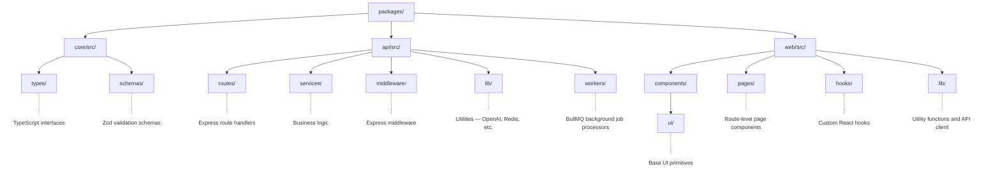

# Contributing to ShipScope

Thank you for your interest in contributing to ShipScope! This guide covers everything you need to get started.

## Development Setup

### Prerequisites

- Node.js >= 20.0.0
- Docker and Docker Compose (for PostgreSQL + Redis)
- npm (comes with Node.js)

### Getting Started

```bash
# Clone the repository
git clone https://github.com/Ship-Scope/Ship-Scope.git
cd Ship-Scope

# Install dependencies (all packages)
npm install

# Start PostgreSQL and Redis
docker compose up -d

# Run database migrations
npm run db:migrate

# Seed demo data (optional)
npm run db:seed

# Start development servers (API + Web)
npm run dev
```

The API runs at http://localhost:4000 and the web UI at http://localhost:3000.

## Project Structure



## Coding Standards

### TypeScript

- **No `any` types** — Use `unknown` and narrow with type guards.
- **Use `import type {}`** for type-only imports.
- **All functions must be typed** — parameters and return types explicit.

### Service Layer Pattern

All business logic goes in service functions (`packages/api/src/services/`).
Route handlers are thin HTTP adapters that:

1. Extract and validate input (Zod)
2. Call a service function
3. Format and return the response

### React Components

- Functional components only (no class components)
- Use TanStack Query for all API data fetching
- Page components use `export default` (required for React.lazy code splitting)

### Styling

- Tailwind CSS utility classes only — no custom CSS files
- Follow the design system defined in `tailwind.config.ts`
- No hardcoded hex colors — use Tailwind theme tokens

## Pull Request Process

### Before Opening a PR

1. **Create a branch** from `main`:

   ```bash
   git checkout -b feat/your-feature-name
   ```

2. **Make your changes** following the coding standards above.

3. **Run the full check suite:**

   ```bash
   npm run lint          # Zero errors required
   npm run typecheck     # TypeScript compilation check
   npm test              # All tests must pass
   npm run build         # Production build must succeed
   ```

4. **Write tests** for new functionality:
   - Service functions: unit tests with mocked dependencies
   - API routes: integration tests with Supertest
   - React components: use React Testing Library for user-facing behavior

### PR Requirements

- Title follows conventional commits: `feat:`, `fix:`, `refactor:`, `docs:`, `test:`
- Description explains the "why" not just the "what"
- All CI checks pass (lint, typecheck, test, build)
- New endpoints have integration tests
- No secrets or `.env` files committed

## Testing

### Running Tests

```bash
npm test                    # Run all tests
npm test -- --run           # Run once (no watch mode)
npm test -- feedback        # Run tests matching "feedback"
npm run test:coverage       # Generate coverage report
```

### Test Conventions

- Test files live alongside source in `tests/` directories
- Use `describe` blocks to group by function or feature
- Use `it` with descriptive names: `it('should return 400 when content is empty')`
- Mock external services (OpenAI) but use real database for integration tests

## Getting Help

- Open a [GitHub Issue](https://github.com/Ship-Scope/Ship-Scope/issues) for bugs or feature requests
