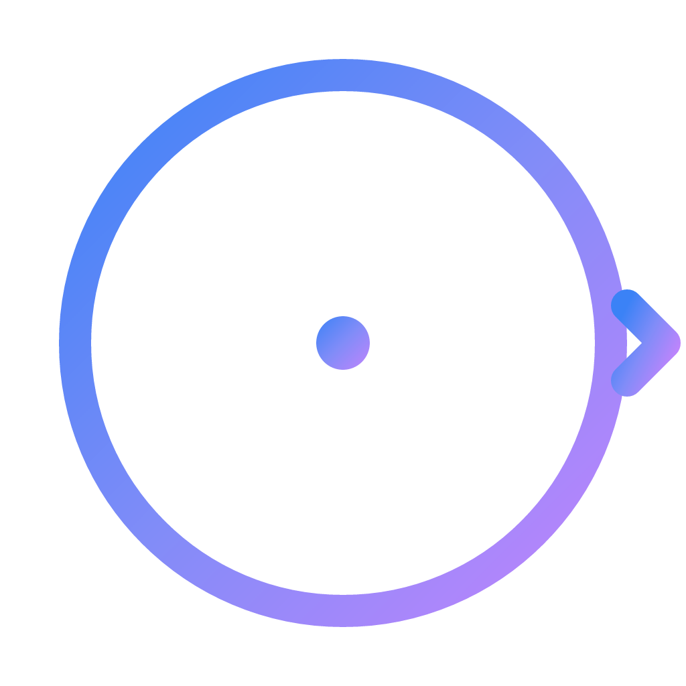
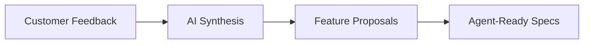
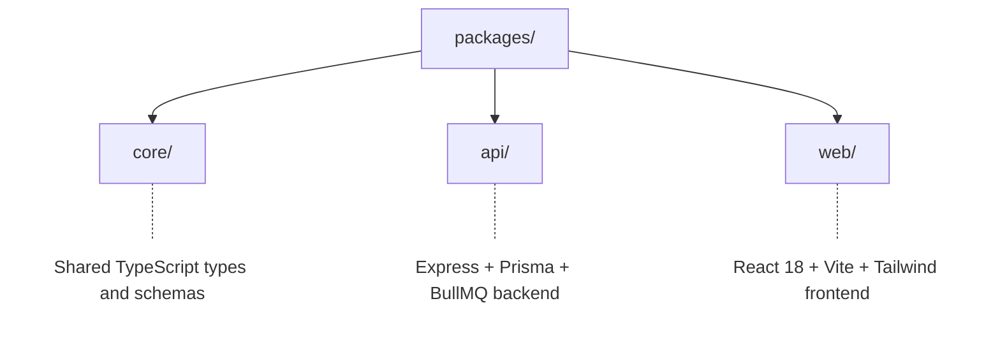

<div align="center">



# ShipScope

[](LICENSE)
[](docker-compose.prod.yml)
[](tsconfig.json)
[](package.json)

**Know what to build, not just how.**

[Quick Start](#quick-start) | [Self-Hosting](docs/self-hosting.md) | [API Reference](docs/api-reference.md) | [Contributing](CONTRIBUTING.md)

</div>

---

## The Problem

Cursor and Claude Code made writing code 10x faster. But the bottleneck shifted upstream — **deciding what to build** is now the hardest part. Product teams drown in scattered feedback across Intercom tickets, Slack threads, user interviews, and analytics dashboards. They make roadmap decisions on gut feel instead of evidence.

## The Solution

ShipScope ingests all your customer feedback, uses AI to find patterns, and tells you exactly what to build next — backed by evidence. Then it generates agent-ready specs you can feed directly to Cursor or Claude Code.



## Features

- **Feedback Ingestion** — Import from CSV, JSON, Jira, Trello, manual entry, or webhooks
- **AI Theme Discovery** — Automatically clusters similar feedback into themes using embeddings
- **Smart Proposals** — AI-generated feature proposals with RICE prioritization
- **Evidence Linking** — Every proposal is backed by real customer feedback
- **Spec Generation** — Generate PRDs and agent-ready prompts from approved proposals
- **Jira Integration** — Bi-directional sync: export proposals/epics to Jira, import Jira issues as feedback, real-time webhook sync
- **Trello Integration** — Export proposals as cards, themes as lists, import Trello cards as feedback, real-time webhook sync
- **Dashboard** — Overview of feedback volume, sentiment trends, and top themes
- **Settings** — AI config, synthesis tuning, Jira configuration, Trello configuration, data management, API key management

## Quick Start

### Prerequisites

- Docker >= 24.0 and Docker Compose >= 2.20
- OpenAI API key

### Run with Docker (Production)

```bash
git clone https://github.com/Ship-Scope/Ship-Scope.git
cd Ship-Scope
cp .env.production.example .env.production
# Edit .env.production with your values
docker compose -f docker-compose.prod.yml --env-file .env.production up -d --build
```

Open http://localhost:3000

### Run for Development

```bash
git clone https://github.com/Ship-Scope/Ship-Scope.git
cd Ship-Scope
npm install
docker compose up -d  # Start PostgreSQL + Redis
npm run db:migrate
npm run dev           # Start API + Web dev servers
```

API runs at http://localhost:4000, Web at http://localhost:3000.

## Architecture



See [docs/architecture.md](docs/architecture.md) for the full system design.

## Tech Stack

| Layer          | Technology                                               |
| -------------- | -------------------------------------------------------- |
| Frontend       | React 18, TypeScript, Vite, Tailwind CSS, TanStack Query |
| Backend        | Express, Prisma, PostgreSQL 16 (pgvector), Redis, BullMQ |
| AI             | OpenAI (gpt-4o-mini, text-embedding-3-small)             |
| Infrastructure | Docker, Docker Compose, nginx                            |

## Documentation

- [Self-Hosting Guide](docs/self-hosting.md) — Deploy ShipScope on your infrastructure
- [API Reference](docs/api-reference.md) — Complete REST API documentation
- [Architecture](docs/architecture.md) — System design and data flow
- [Contributing](CONTRIBUTING.md) — How to contribute to ShipScope

## Contributing

We welcome contributions! Please read our [Contributing Guide](CONTRIBUTING.md) before getting started.

- [Report a bug](https://github.com/Ship-Scope/Ship-Scope/issues/new?template=bug_report.md)
- [Request a feature](https://github.com/Ship-Scope/Ship-Scope/issues/new?template=feature_request.md)
- [Submit a PR](CONTRIBUTING.md)

## License

ShipScope is open-source under the [AGPL-3.0 license](LICENSE).

- Free to use, modify, and self-host
- Free for commercial use within your organization
- If you modify and distribute as a service, you must open-source your changes

---

<p align="center">
  <sub>Built for product teams who want to ship the right thing.</sub>
</p>
