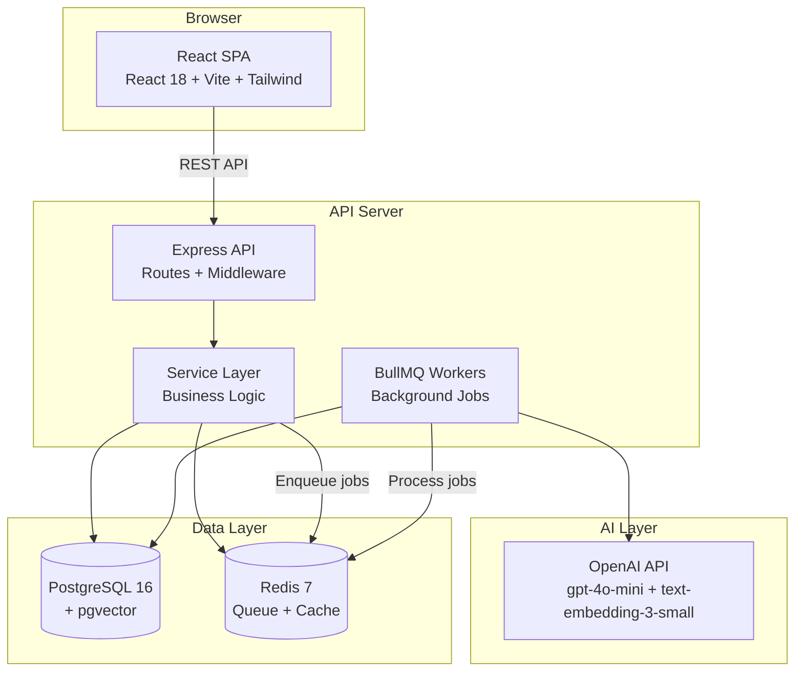

# ShipScope Architecture

## System Overview

ShipScope is a monorepo with three packages:

```
shipscope/
├── packages/
│   ├── core/     # Shared TypeScript types and Zod schemas
│   ├── api/      # Express REST API + BullMQ workers
│   └── web/      # React SPA (Vite + Tailwind)
```

## Architecture Diagram



## Data Flow

### 1. Feedback Ingestion

```
User Upload/Webhook → Express Route → Zod Validation → Sanitization
  → Feedback Service → Prisma INSERT → PostgreSQL
  → Enqueue embedding job → Redis/BullMQ
```

### 2. AI Synthesis Pipeline

```
Synthesis Trigger → BullMQ Job Queue → Worker picks up job
  → Step 1: Generate embeddings (OpenAI text-embedding-3-small)
  → Step 2: Store embeddings in pgvector
  → Step 3: Cluster similar feedback (cosine similarity)
  → Step 4: Extract themes (OpenAI gpt-4o-mini)
  → Step 5: Generate proposals with RICE scores (OpenAI gpt-4o-mini)
  → Step 6: Store results in PostgreSQL
```

### 3. Dashboard Data Flow

```
React Component mounts → TanStack Query fetches /api/dashboard/stats
  → Express Route → Dashboard Service → Check Redis cache
    → Cache HIT: return cached data (< 5ms)
    → Cache MISS: query PostgreSQL → cache result (60s TTL) → return
  → React Query caches in browser → Re-render with data
```

## Component Responsibilities

| Component        | Responsibility                                  | Does NOT do                                  |
| ---------------- | ----------------------------------------------- | -------------------------------------------- |
| `packages/core`  | TypeScript types, Zod schemas, shared constants | Business logic, I/O, database access         |
| Express Routes   | HTTP parsing, validation, response formatting   | Business logic, direct DB queries            |
| Service Layer    | Business logic, orchestration, caching          | HTTP concerns, direct Prisma calls in routes |
| Prisma ORM       | Database queries, migrations, type-safe access  | Business logic, HTTP concerns                |
| BullMQ Workers   | Background job processing, AI pipeline          | Serving HTTP requests                        |
| React Components | UI rendering, user interaction                  | Direct API calls (uses TanStack Query)       |
| TanStack Query   | API data fetching, caching, sync                | UI rendering, business logic                 |

## Database Schema (simplified)

```
FeedbackItem ──< FeedbackThemeLink >── Theme ──< Proposal ── Spec
    │                                     │
    └── embedding (pgvector)              └── feedbackCount (denormalized)
```

Key tables: FeedbackItem, Theme, Proposal, Spec, ApiKey, Setting, ActivityLog

## Security Layers

1. **Input sanitization** — HTML tags stripped from all string inputs
2. **CORS** — Whitelist-only origin validation
3. **Helmet** — CSP, X-Frame-Options, HSTS headers
4. **Rate limiting** — Per-IP and per-API-key limits
5. **API key hashing** — HMAC-SHA256 with timing-safe comparison
6. **HTTPS redirect** — Enforced in production via X-Forwarded-Proto
7. **Non-root containers** — API and Web run as unprivileged users
