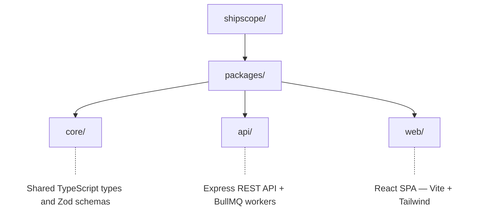
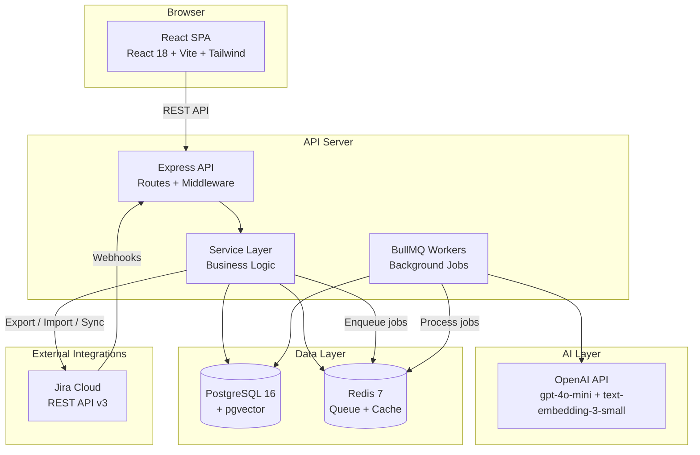
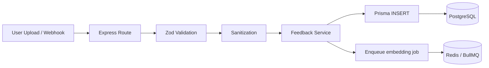
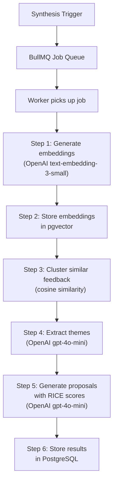
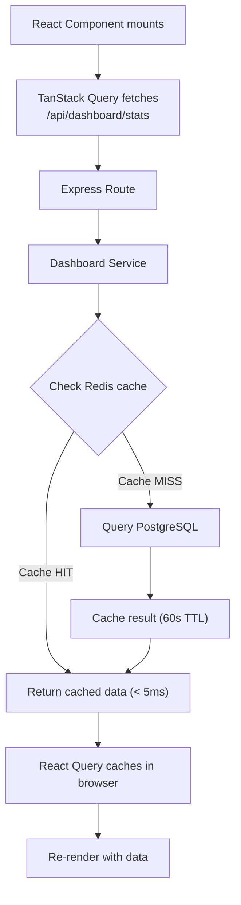
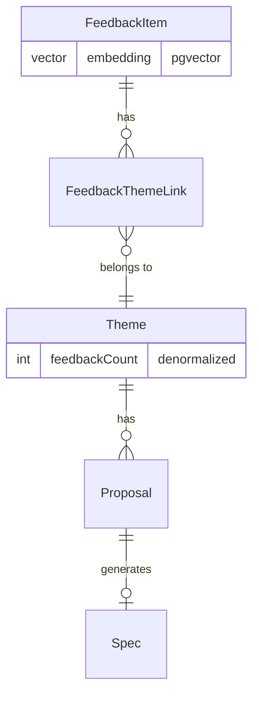

# ShipScope Architecture

## System Overview

ShipScope is a monorepo with three packages:

## Architecture Diagram

## Data Flow

### 1. Feedback Ingestion

### 2. AI Synthesis Pipeline

### 3. Dashboard Data Flow

## Component Responsibilities

| Component        | Responsibility                                  | Does NOT do                                  |
| ---------------- | ----------------------------------------------- | -------------------------------------------- |
| `packages/core`  | TypeScript types, Zod schemas, shared constants | Business logic, I/O, database access         |
| Express Routes   | HTTP parsing, validation, response formatting   | Business logic, direct DB queries            |
| Service Layer    | Business logic, orchestration, caching          | HTTP concerns, direct Prisma calls in routes |
| Jira Service     | Jira API integration, export/import/sync        | UI rendering, HTTP concerns                  |
| Prisma ORM       | Database queries, migrations, type-safe access  | Business logic, HTTP concerns                |
| BullMQ Workers   | Background job processing, AI pipeline          | Serving HTTP requests                        |
| React Components | UI rendering, user interaction                  | Direct API calls (uses TanStack Query)       |
| TanStack Query   | API data fetching, caching, sync                | UI rendering, business logic                 |

## Database Schema (simplified)

Key tables: FeedbackItem, Theme, Proposal, Spec, JiraIssue, ApiKey, Setting, ActivityLog

## Security Layers

1. **Input sanitization** — HTML tags stripped from all string inputs
2. **CORS** — Whitelist-only origin validation
3. **Helmet** — CSP, X-Frame-Options, HSTS headers
4. **Rate limiting** — Per-IP and per-API-key limits
5. **API key hashing** — HMAC-SHA256 with timing-safe comparison
6. **HTTPS redirect** — Enforced in production via X-Forwarded-Proto
7. **Non-root containers** — API and Web run as unprivileged users
